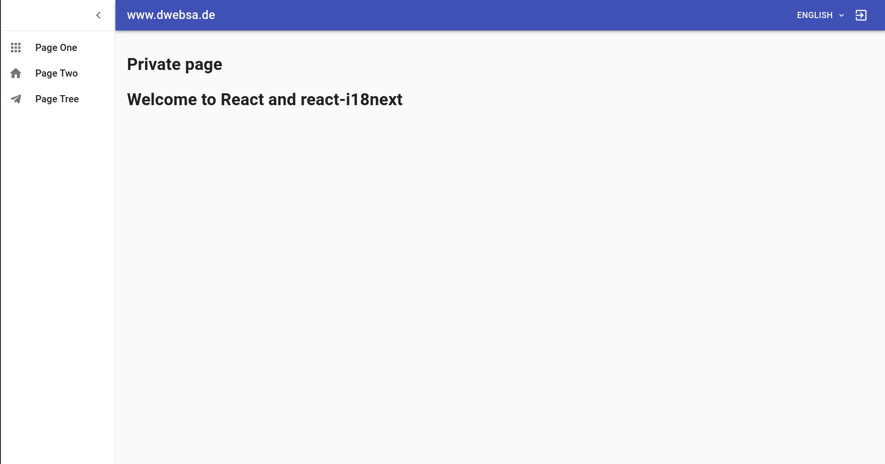

## Getting Started

### APP
1. ```cd app```, then, ```pip install -r requirements.txt```
2. ```flask run```
3. Server should be running at ```localhost:5000```


### Frontend
1. ```cd frontend```, then, ```npm install```
2. To run, ```npm start```
3. Server should be running at ```localhost:3000```


### Users

```python
    valid_user_1 = {'username': "user", 'password': '123'}
    valid_user_2 = {'username': 'admin', 'password': '1234'}
```

## Frontend screen


